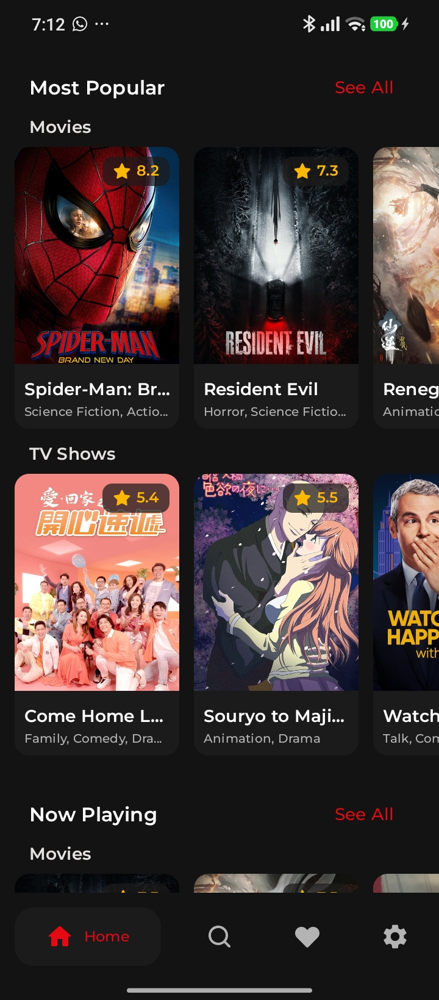
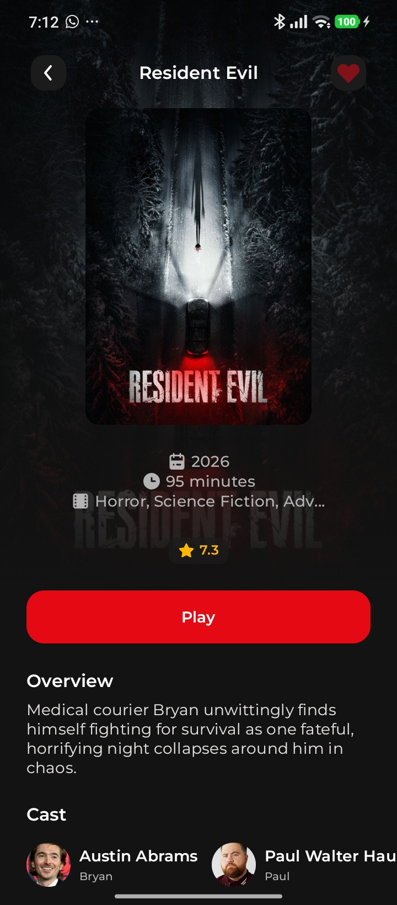
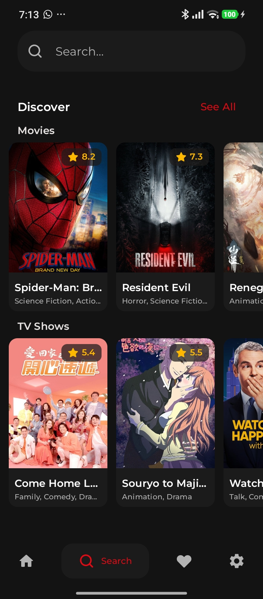
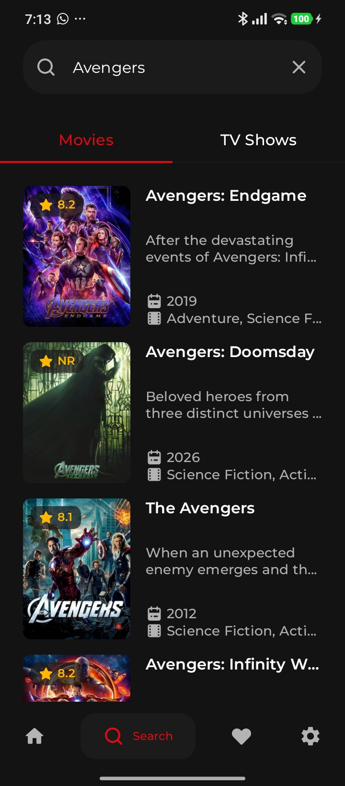
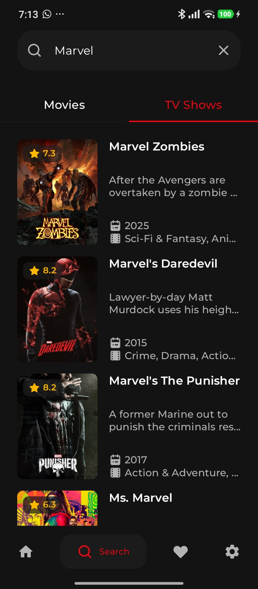
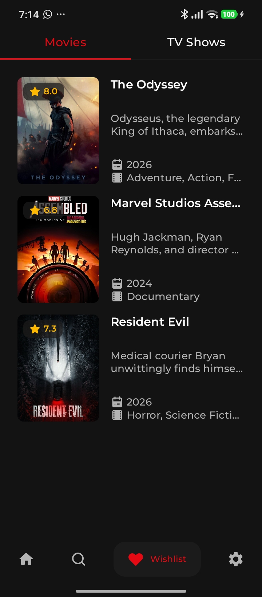
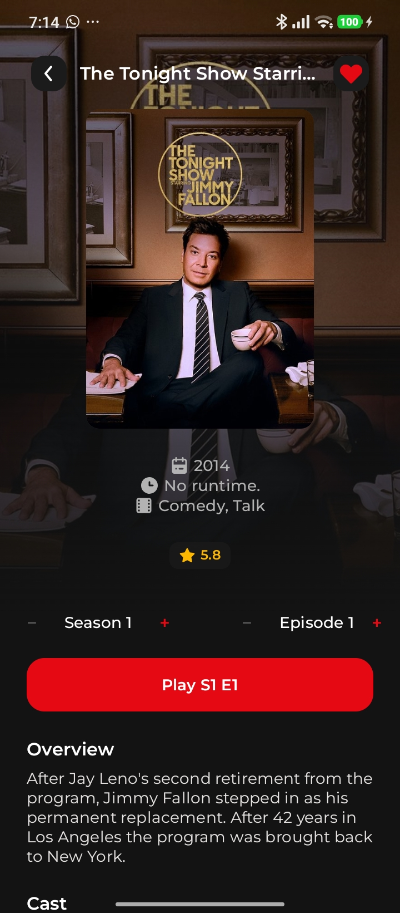
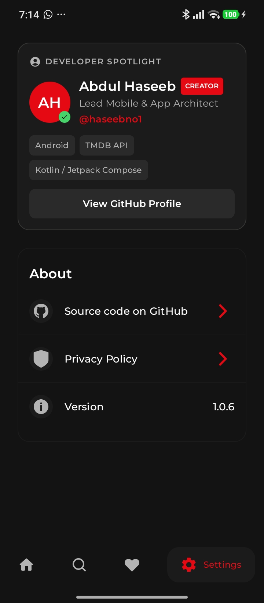

<p align="center">
  
</p>

<h1 align="center">Haseeb-Flix</h1>

<p align="center">
  <b>Your ultimate ad-free Android app to stream movies, watch TV show episodes, and discover trending entertainment for free.</b>
</p>

<p align="center">
  <a href="https://github.com/haseebno1/Haseeb-Flix/releases/latest/download/app-release.apk">
    
  </a>
</p>

<p align="center">
  
  
  
  
</p>

---

## 🎬 Why Choose Haseeb-Flix?

* 🍿 **Instant Movie & TV Streaming:** Stream trending movies and full TV show episodes directly on your Android device with seamless playback.
* 📺 **One-Tap Episode Playback:** Select seasons and episodes effortlessly with the built-in *Play S1 E1* player for TV series.
* 🔍 **Smart Content Search:** Search across thousands of titles with instant filters for movies and TV shows.
* ❤️ **Personal Watchlist:** Bookmark your favorite movies and shows to build a custom streaming queue.
* 🛡️ **Ad-Free & No Subscription:** Enjoy a premium, dark-themed streaming interface with zero popups, zero forced ads, and no account required.

---

## 📲 How to Install & Watch (Android APK)

1. Tap the **[Download APK](https://github.com/haseebno1/Haseeb-Flix/releases/latest/download/app-release.apk)** badge at the top of this page on your Android device.
2. Open the downloaded `.apk` file from your browser downloads or file manager.
3. If prompted by your device, enable **"Install from unknown sources"**.
4. Open **Haseeb-Flix** and start streaming immediately!

---

## 📱 App Screenshots

<table>
  <tr>
    <td align="center"><br /><sub><b>Home Stream Feed</b></sub></td>
    <td align="center"><br /><sub><b>Movie Stream Player</b></sub></td>
    <td align="center"><br /><sub><b>Discover Titles</b></sub></td>
    <td align="center"><br /><sub><b>Search Movies</b></sub></td>
  </tr>
  <tr>
    <td align="center"><br /><sub><b>Search TV Series</b></sub></td>
    <td align="center"><br /><sub><b>Saved Watchlist</b></sub></td>
    <td align="center"><br /><sub><b>Seasons & Episode Play</b></sub></td>
    <td align="center"><br /><sub><b>Settings & Info</b></sub></td>
  </tr>
</table>

---

<details>
<summary><b>🛠️ Technical Specifications & Build Instructions (Click to Expand)</b></summary>

<br />

### Tech Stack

| Layer | Technology |
| --- | --- |
| **Language** | Kotlin |
| **UI Framework** | Jetpack Compose |
| **Target Platform** | Android |
| **Media Metadata** | [TMDB API](https://www.themoviedb.org/documentation/api) |

### Building from Source

1. **Clone Repository**
   ```bash
   git clone [https://github.com/haseebno1/Haseeb-Flix.git](https://github.com/haseebno1/Haseeb-Flix.git)
   cd Haseeb-Flix

```
 2. **Set API Keys**
   Add your TMDB API key inside local.properties:
   ```properties
   TMDB_API_KEY=your_api_key_here
   
   ```
 3. **Compile & Run**
   Open in Android Studio (JDK 17+) and run on an Android emulator or test device (**Run ▶ Run 'app'**).
### Directory Structure
```text
Haseeb-Flix/
├── app/            # Primary Android source module
├── assets/         # App icons and graphics
├── screenshots/    # Preview images for documentation
└── README.md

```
</details>
## 👨‍💻 Author
Developed by **Abdul Haseeb** – Lead Mobile & App Architect
 * **GitHub:** @haseebno1
## 📜 Acknowledgements & Legal
Media catalog powered by The Movie Database (TMDB).
*Disclaimer: Haseeb-Flix uses the TMDB API for catalog information but is not endorsed or certified by TMDB.*
<p align="center"><b>If you enjoy streaming with Haseeb-Flix, leave a ⭐ on GitHub to support development!</b></p>w
